## 2019를 돌아보며

```군대```라는 포인트에서 나를 발전시키고자 노력했던 1년이였다.

### 진행한 Project
>  GnuBoard youngcart5 버그 바운티
- 동아리 선배이자 웹 해킹의 길의 선배가 실력을 키우는 길로 추천해주셔서 시작했다.
- 엄청 삽질하다 아무것도 못 찾아서 흥미 떨어질 때 쯤 선배가 도움을 주셔서 한 요소를 찾게 되었고 KISA 버그 바운티 제보도 해보게 되었다. 물론 중복처리되어 등록은 되지 못했다 ㅠㅠ.. 
> TODO
- ToDo 사이트들은 많은데 내가 원하는 형태는 없어서 뭘 쓰지 하다가 깃허브 이슈로 ToDo를 쓰는 힙한 유저를 보고 바로 따라하기 시작했다.
- 현재 89에 TODO중 48개를 처리하고 41개가 처리가 안 되어 있는데 연초에 최대한 다 처리해서 10개 이하로 처리할 양을 줄여보려한다.
> TIL ( Today I Learned )
- 트위터에서 개발자들이 하루하루 개발한 걸 올리면서 동기부여를 하는 것을 보고 이거다! 하고 바로 계획을 잡았다.
- 처음에는 그냥 Github에 TIL 레포를 만들고 Markdown 문서 형태로 올렸는데 [진유림님의 TIL 페이지](https://milooy.github.io/TIL/)를 통해 VuePress라는 좋은 프레임워크를 알게되었다.
- 1일 1커밋과 연계하여 11월 까지 열심히 진행하다가 유격과 건강상 문제로 잠시 중단되었다. 내년부턴 다시 활발히 할 생각이다.
- TIL 페이지 주소 ( [til.syru.dev](https://til.syru.dev) )
> 1일 1커밋

  - 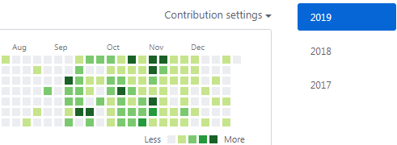
- 7일 도전, 10일 도전에서 습관이 들면서 11월 초까지 Full로 진행되었다.
- 커밋을 하기 위해 If Kakao 키노트나 즐겨보는 개발자 글도 유심히 보는 순 기능이 있었다.
- 허나 점차 커밋을 위한 커밋만을 하게되어 잠시 중단하였다.
> Resume
- 이력서를 한번쯤 써봐야지 하고 TIL과 함께 시작했다.
- 쓰다보니 내가 생각보다 한 것이 많다는 점을 알게되었다.
- 내년에는 이력서에 적을 수 있는 활동이나 자격증 취득을 열심히 해야겠다.
> 1LineDiary
- Node.js와 MongoDB를 활용한 Toy Project로 계획되었다.
- 한 줄 일기에 그 날을 표현하는 색이라는 시각적이면서 심플한 계획을 세웠다.
- db에 저장될 내용이 많지 않아서 sqlite를 써야겠다 생각되었다.
- sqlite3를 활용하여 DB에 내용을 채우곤 있으나 이것이 커밋을 위한 커밋의 시초가 되어버렸다.
- Front-end 기술스택을 좀 쌓은 후 젤 먼저 완성하고 싶다.
> 원격 작업환경 조성
- 사지방 연등에 대해 알게된 후 내가 하고 싶은 작업들을 편하게 할 수 있는 공간이 필요했다.
- 초반에 Goorm IDE와 자동 lxde + xwindow 설치 스크립트를 통해 텔레그램 정도 할 수 있는 환경을 조성해서 썼었다.
- 너무 사양이 안좋아서 계속 끊기자 vultr나 NCP, GCP, Azure에 눈을 돌렸고 그중 Azure Student Free Tiar를 알게되어 잘 썼다.
- 프리 티어 기간이 끝나고 못 쓰게 되었다가 집 노트북을 팀뷰어를 활용해 열심히 셋팅해놓고 현재까지 잘 쓰고 있다.

### 진행하지 못한 Project
> Lord OF Sqli 완주 하여 SQLi 기술 익히기
- 기존 los 에서 에러를 유발하여 푸는 문제부터 막혀서 진전을 못함
- 필요성이 그때부터 의심되며 버그바운티로 바로 전이
> Front-End 공부 ( vue, js, bootstrap... )
- 인프런 강좌, 책을 모두 구매해뒀지만 흥미를 바로 잃고 실패
- 지인들이 나에게 가진 잘못된 기대 ( 원인 : 나의 잘못된 자기 흥미 인식 )
> GraphQL, FireBase 공부
- 신개념에 대한 습득 및 토이 프로젝트로 익히려 함
- 집중이 도저히 안되서 실패
> Web Fuzzer Project - "Digda" Refactoring
- 작년 인코그니토 당시 진행했던 퍼저 프로젝트를 리팩토링 해보고자 함
- 진정한 개발실력은 짤 때보다 짠 것을 고칠때 나올 것이라는 믿음
- 만들때도 그랬지만 구체적인 방향을 못 짜다가 흐지부지
> 오픈소스 라이선스 공부
- "나는 LINE 개발자입니다"에 오픈소스 개발자분 글을 읽고 라이선스 공부를 하고자함
- 흥미가 있었던 그 당시에 바로 진행했어야 했으나 흐지부지됨
> XXE , XSS 연구
- 보안에 대한 길을 가기위해 필요하다 생각
- 흥미도 안나고 그 당시 환경 갖추기가 힘들어 흐지부지
> Deep Learning을 이용한 목소리 샘플을 이용하여 그 목소리로 다른 메시지 내기
- 진짜 하고 싶음
- 이 딥러닝이 가능한 환경의 부재
- [참고 레포](https://github.com/corentinj/Real-Time-Voice-Cloning)
- [TODO내 계획](https://github.com/l0vey0u/ToDo/issues/82)

### 오픈소스 프로젝트 기여 내역
> [guac-install](https://github.com/MysticRyuujin/guac-install)
- Guacamole이라는 원격 중계서버 데몬의 자동구성 스크립트
- 기여 내역 : TOTP ( Two Factor OTP ) 기능이 접근성을 상당히 해쳐서 설치할 때 부터 제외하도록 스크립트를 수정 및 [PR](https://github.com/MysticRyuujin/guac-install/pull/93)
- 상세 : 처음에는 [이슈](https://github.com/MysticRyuujin/guac-install/issues/92)를 올렸지만 만들면 반영하겠다는 답변을 받고 직접 만들어 PR하니 Merge 해주셨다.

### 읽은 책
> 박사가 사랑한 수식

- 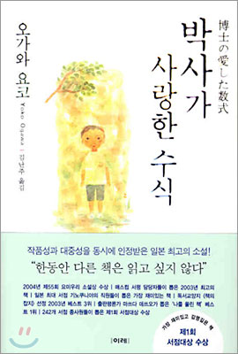
- 중학교 때 부터 계속 읽는데 읽을 때마다 감회가 새롭고 재밌는 책이다. 명작!
> 실무자가 말하는 모의해킹


- 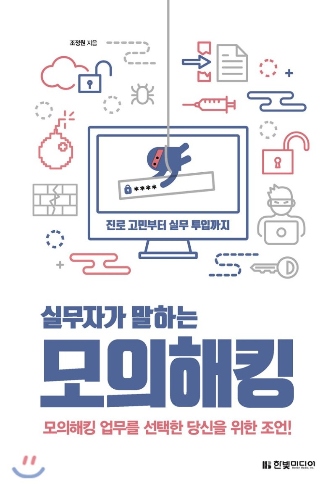
- 모의해킹전문가로 꿈을 정해놓고 책을 샀지만 내가 원하는 방향이 맞는지 확인하는데는 내용이 좀 부족했다.
> 모의해킹이란 무엇인가


- 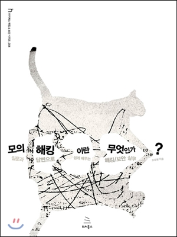
- 모의해킹전문가로 꿈을 정해놓고 책을 샀지만 내가 원하는 방향이 맞는지 확인하는데는 내용이 좀 부족했다. 2탄
> 나는 LINE 개발자입니다.


- 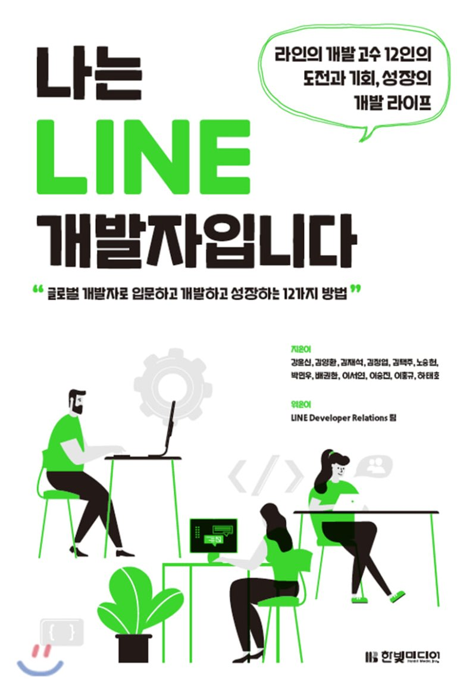
- LINE개발자들의 이야기를 써놓은 책 유익하고 완독후 동기부여가 잠깐 되었다.
> 개발자의 글쓰기


- 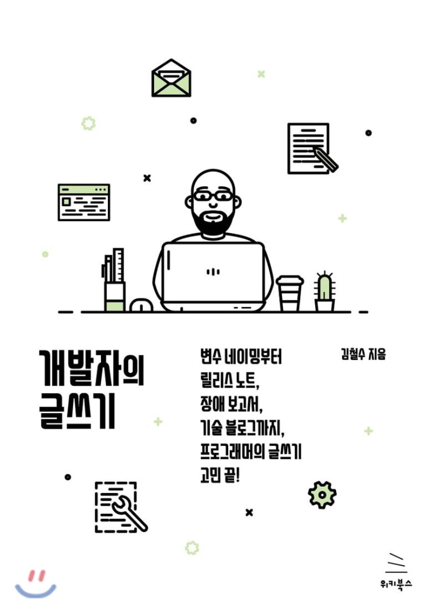
- 개발자의 필수 교양인 글 쓰기를 잘 가이드 해주는 책, 참고 도서로 계속 두려했지만 돈이 부족해서 팔게되었다 ㅠ_ㅠ 
> 코딩을 지탱하는 기술


- 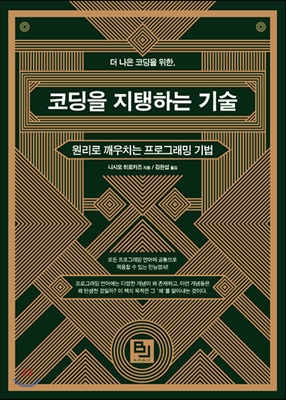
- 수 많은 언어가 있지만 Type, String 등 뼈대들은 다 똑같고 그걸 어떻게 처리하는가에 따라 다르다는 것을 잘 보여준 책
> 커리어 스킬


- 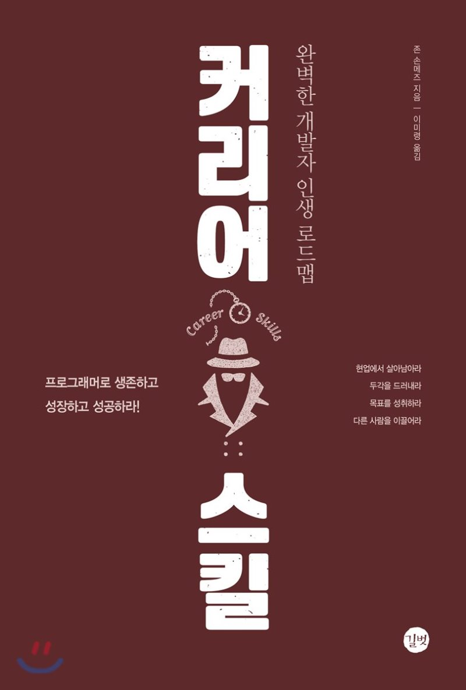
- 다양한 커리어 쌓기에 관련한 내용이 들어있다. 부트캠프라는걸 처음 알게되었다. 
> 일 잘하는 사람은 단순하게 합니다.


- 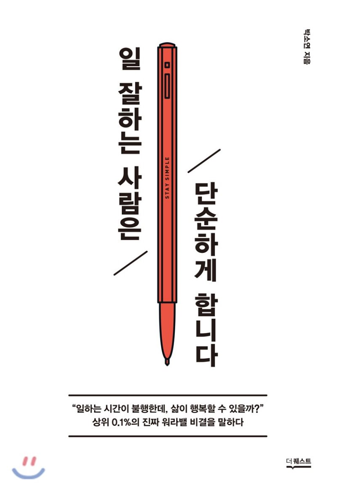
- 일을 잘하고 싶어서 구매했다. 어디선가 들어본 내용이 많았는데 그 책을 읽을 때는 도움이 될 것 같았지만 2주 후 변함없는 일 처리를 보여주었다.
> 죽고 싶지만 떡볶이는 먹고 싶어 2


- 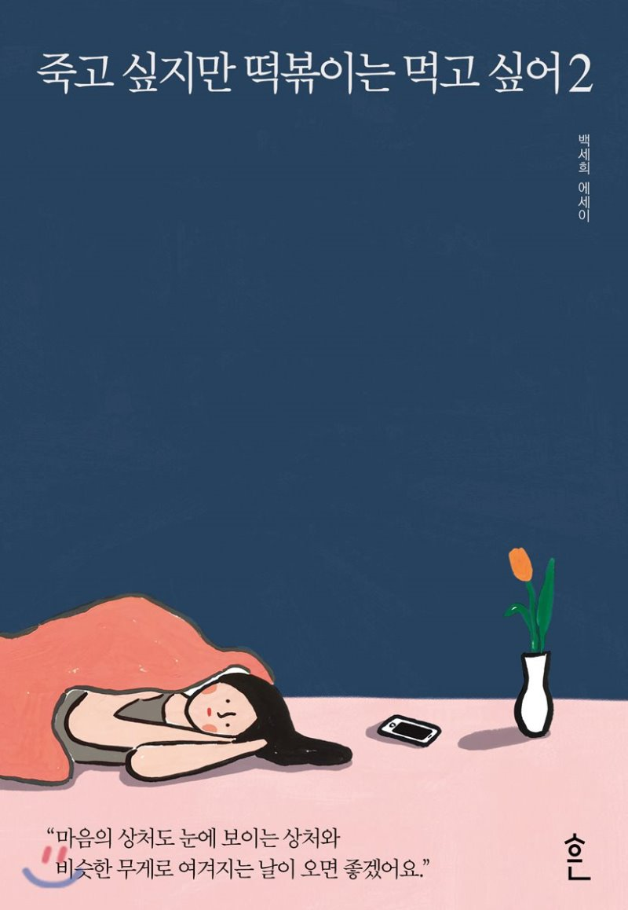
- 너무나도 유명하고 그 당시 우울했어서 사보았는데 정신과 의사와 상담받는 내용인데 묘하게 빠져든다. 전체적인 내용이 가볍지는 않고 불편할 수 도 있다. 
> 언어의 온도


- 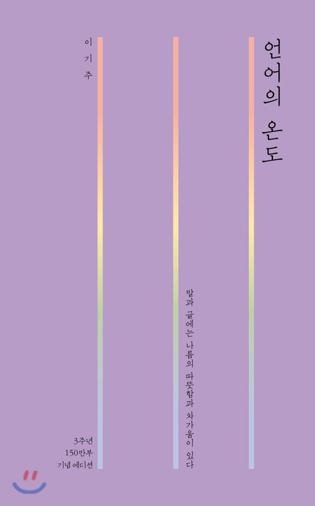
- " 그냥이라는 말은 굳이 이유를 대지 않아도 될 만큼 충분히 소중하다는 것을 의미하기도 한다. " 라는 문장이 인상적이였던 장규리가 추천해준 책

### 읽고 있는 책
> IT에 몸담은 이들을 위한 지적 생산 기술


- 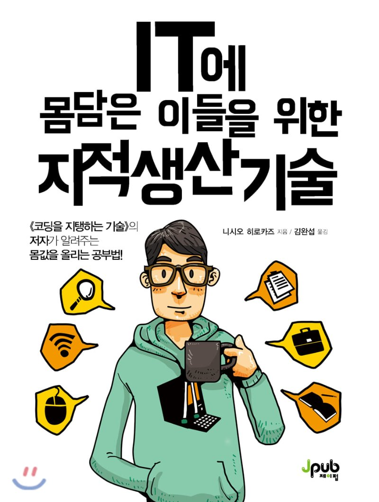
- 어떻게 해야 효율적인 작업을 하고 계획을 하는지 명확히 써져 있다.
- 읽는 것으론 변화하지 않는다는 것을 "일 잘하는 사람은 단순하게 합니다."에서 느꼈기 때문에 길고 실천형으로 읽는 중이다.

### 군 생활
> 정보보호병 면접
- 공군 2월 지원했으나 1차 서류 탈락 (수상내역 및 동아리 내역을 인정받지 못함)
- 5월 육군 정보보호병 지원 UMASK, OWASP 변화한 내용 등을 잘 대답하고 블루본을 잘 기억해내 2등으로 합격
> 훈련소
- 우울증의 시작
- 인편의 소중함
- 발톱백선 : 아직도 완치 되진 못하였다.
> 정보통신학교 (후반기 학교)
- 긴장의 완화
- 소비의 시작 : 1일 1 PX
> 상무대 CERT
- 전방으로 많이 가는 정보보호병 중 유일한 최후방 멤버였다.
- 근무지원단이라는 기행부대 특성 상 훈련은 큰 훈련들 밖에 없다.
- 꽤 많은 노드들을 관리하고 있다.
> 육군 해킹 방어대회
- 운 좋게도 올해 육해방이 연기되어 소마출신 선임과 나가게 되었다.
- 리버싱 공부를 열심히 하여 crackme를 언패커 요구되는거 제외 모두 풀어보았다.
- 전 날엔 포렌식 공부를 좀 하여 Registry에 대해 공부하였다.
- 정보보안산업기사 필기 공부하던 것이 머리에 남아있어 필기는 매우 쉬웠다.
- 실기는 많은 내용은 못 말하고 그저 내가 정통교에서 해킹 시나리오를 쓸 때 생각했던 것이 그대로 구현됬다는 것이 좀 놀랐다.
- [전날 일기](https://github.com/l0vey0u/TIL/blob/master/queue/2019-08-27/TwoStar.txt), [당일날 일기](https://github.com/l0vey0u/TIL/blob/master/queue/2019-08-28/WasMyIdea.txt)
- 로그에 대한 포렌식과 쉘 코드 및 dll 디버깅을 좀 알아둬야 겠다.
> OSAM (Open Source Academy for Military) 집체교육 지원 및 탈락 후기
- 
> 휴가
- 신병위로휴가 (10월 28일 ~ 10월 31일)
  - 설렁탕 : 지금은 전역한 *진정형이 같이 휴가쓰고 좀 안다는 이유로 설렁탕을 사주셨다. 그때부터 맛있다는 것을 알게되었다.
    - 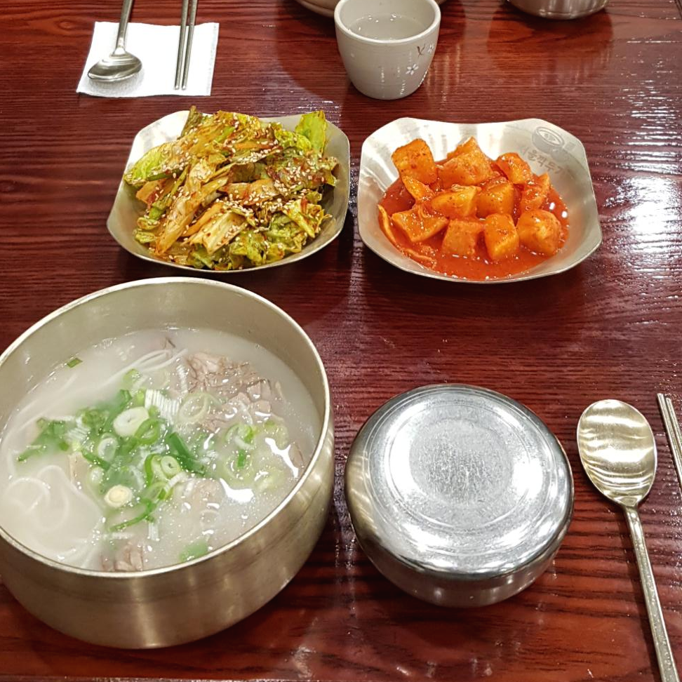
  - 규카츠 : 고기 질 좋은 곳을 가야겠다, 치익~ 지져서 와사비 좀 놓고 먹는건 좀 재밌었다.
    - 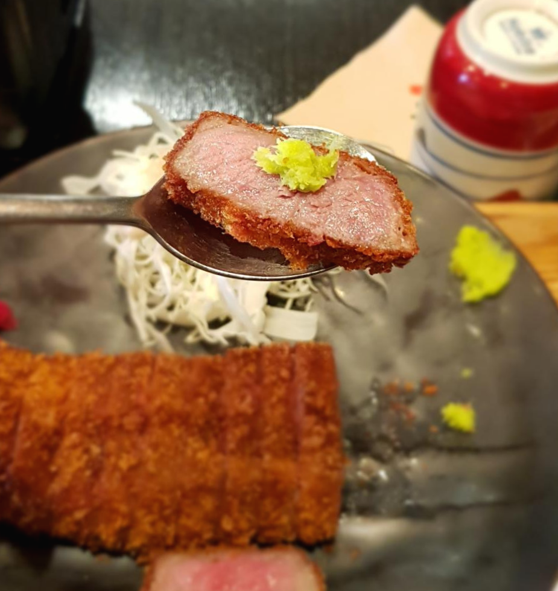
  - Some Hackers 정모
    - 코다차야 : 내가 사준다고 결제했는데 3만원 쿠폰이 당첨됬는데 기한이 1월까지다 1월 휴가때 가야지!
      - 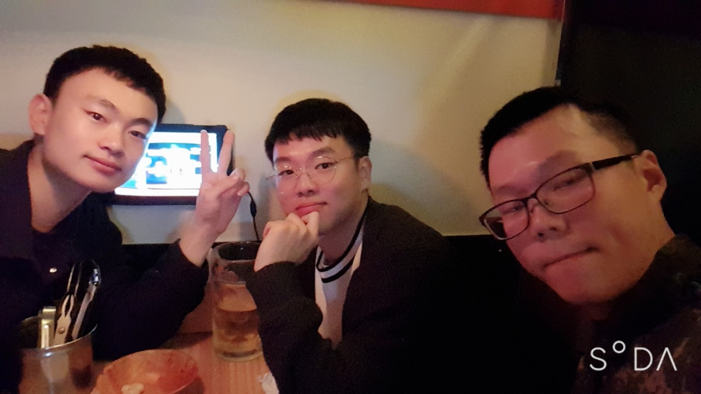
    - 각자 사는 이야기는 다 똑같은 군 생활이였다
  - 제 9회 소프트웨어 개발보안컨퍼런스
    - 일단 밥이 제일 유익했다. ( 이 컨퍼런스는 밥이 맛있기로 유명합니다. )
      - 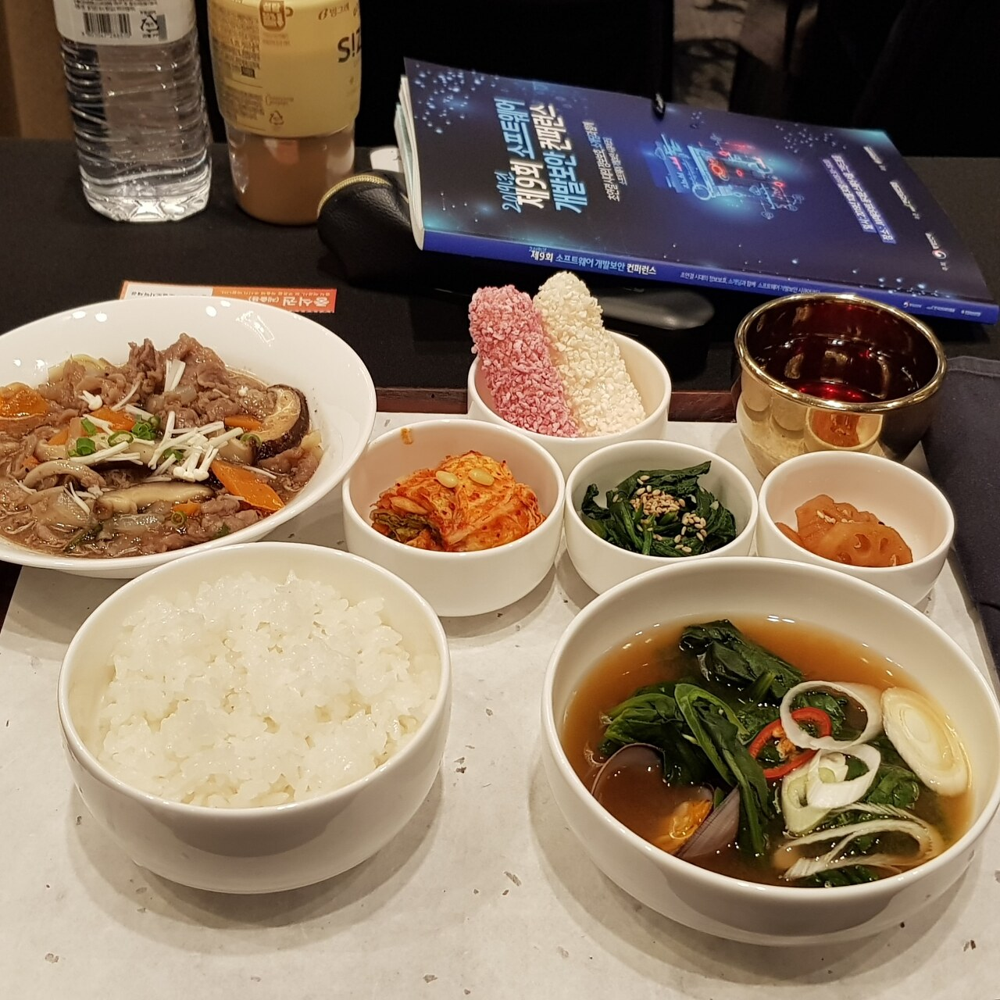
- 2일 휴가 (11월 31일 ~ 12월 1일)
  - 이상적이였다면 정보보안산업기사 실기 보는데 썻어야 했지만 트롤링을 한 관계로 유격 보상으로 쓰게되었다.
  - 술 먹고 나선 잘 자는게 진짜 중요하다는 걸 알게되었다 후유증과 덤으로 코트 하나를 잃었다 ㅠ..
  - 동기와 후배에게 동아리와 학교 상황이 별로 안 좋다는 것을 듣게 되었다. 걱정이 좀 되었다.
- 첫 병가 (12월 24일 ~ 12월 25일)
  - 예상보다 더 빨리 끝나버려서 엄마와 뭐 할까 하다가 교대 장꼬방에서 소박하게 먹고 낙산공원가서 야경과 커플을 보며 산행하였다.
  - 엄마랑 김치전, 파전, 막걸리 먹으며 자취에 대한 얘기와 우리 집에 대한 얘기를 하였다. 복잡했고 내 자취에 대한 생각을 깨주었다.
  - 창경궁은 생각보단 재미없었는데 엄마는 역사를 좋아하는 건지 매우 좋아하셔서 그건 기분 좋았다.
> 유격

  - 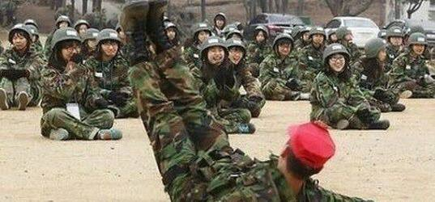
- 아니 온몸비틀기를 보며 웃을 수 있는 저 사람들은 뭐지? 난 허벅지 안올라가고 허리 아파서 바로 열외던데
> 표창장
- 윈도우7이 보안업데이트가 종료되면서 윈10으로 다 전환하면서 새 PC로 교체해주는 작업이 진행되었다.
- 그로인해 11,12월이 뚝딱 사라질정도로 바빴는데 그 공로를 인정받아 연대급 표창을 받게되었다.
  - 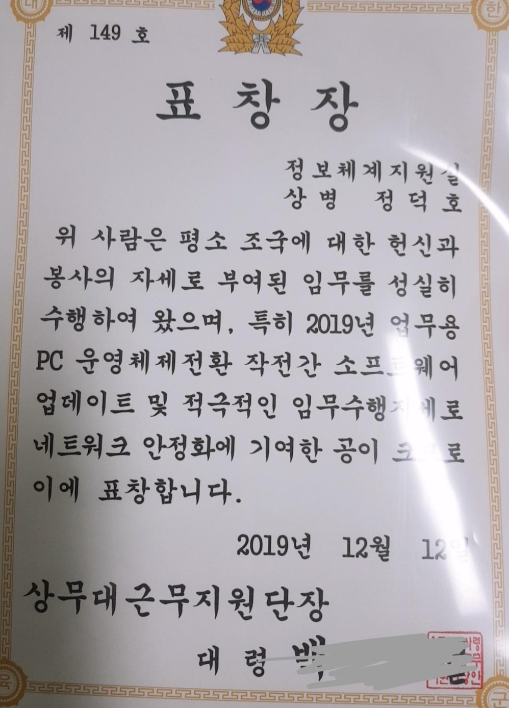

### 건강
> 한 줄 요약
- 감기 같이 간단한 것들은 오히려 안 걸리다가 작업하다가 짧게 실신하는 큰 사건 하나를 일으켰다.
> 기절
- 12월 5일에 블랙리스트 차단 목록을 갱신하는 작업을 자동화가 아닌 손수 일일이 하게되어 좀 힘들었었다.
- 작업하다가 목 말라서 물 뜨러 가다가 어? 하고 정신을 차려보니 물 컵은 깨져있고 난 앉은 느낌으로 엎어져있었다.
- 당일 날 혈압을 160찍었고 심전도 당시 정상이였다.
- 소뇌에 물혹이 있다는 것도 알게 되었다.
- 썰이 있다. (MRI 찍다가 병원 화재난 썰, 진료의뢰서 받으러 갔다가 붕어빵 먹은 썰, 병원 의사 제자가 군의관이였던 썰)
- 정밀검사를 위해 병가를 받았는데 병원 측이 진짜 정밀 검사 진단만 하고 진료 예약은 다른 날에 하도록 해 병가 2번을 또 나가야 한다.
> 우울증 a.k.a 신경 예민
- 신경이 좀 예민한 편이라 줄 곳 포인트마다 겪는다.
- 그렇게 심한 상황은 아닌 것 같다.

### 취미 생활
> IZONE
- 첫 휴가때 아이즈원 1주년 기념 까페에 가서 찍은 사진
  - 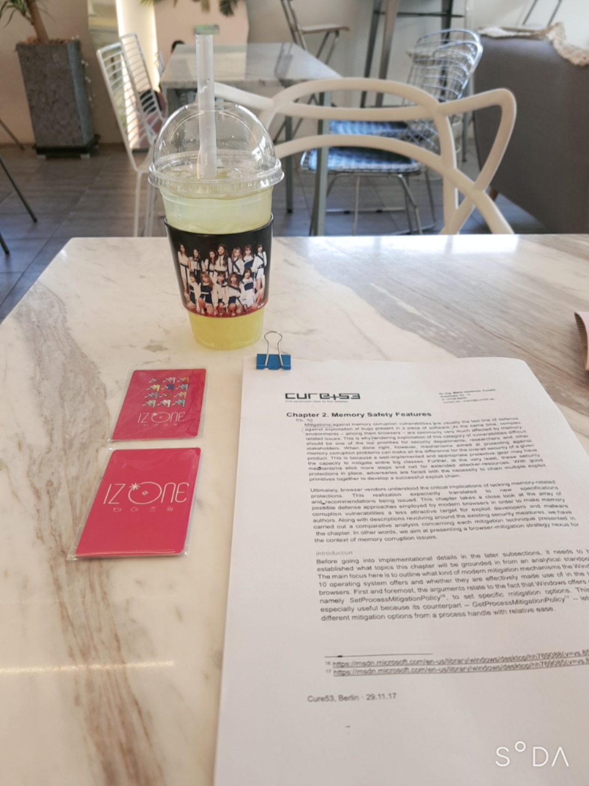
- 내년 달력도 필요한 겸 사서 잘 쓰고 있는 달력 ( Feat. minju_777 )
  - 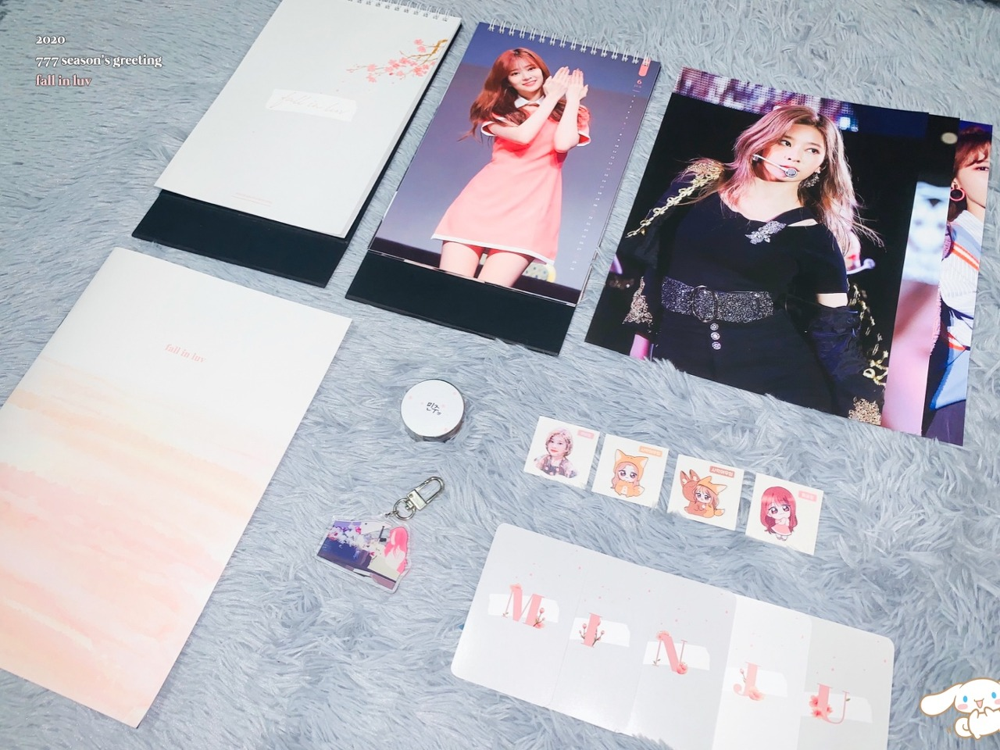
> 오버워치
  - 부계로 골드까지 가봤다. 그 당시엔 루시우로 캐리를 좀 했다.
  - 부계가 정지되버린 이후 본계로 배치를 돌렸는데 힐러는 2승 3패로 브론즈(1308) 나오고 딜러는 4승 1패로 실버(1603)나왔다.
  - 현재 힐러 주캐는 아나, 바티스트 딜러 주캐는 파라, 정크렛인데 이 게임은 그냥 밀어주는 캐릭 하는게 답인 것 같다. 
### 자격증
> 2종 보통 운전면허
- 아빠가 남자라면 가지고 있어야 된다고 돈 까지 내주셔서 공부하게 되었다.
- 필기야 뭐 공부안해도 그냥 합격했고 실기가 문제였는데 장내 기능시험은 두번보니까 적응되서 부드럽게 성공했는데 도로주행은 너무 긴장되서 힘들었다.
- 근데 아직도 도로가 무섭다 ㅠ.ㅠ
> 정보보안산업기사 필기
- 훈련소때 부터 공부를 시작했지만 자대와서야 제대로 각잡고 공부하였다.
- 풀다보니 익숙한 내용들이 꽤 있어서 수월했다.
- 필기 문제를 보니 익숙한 애들도 있는 반면 처음보는 애들도 꽤 되서 불안했는데 커트라인이 워낙 낮다보니 안심되었고 생각보다 높은 점수로 합격하였다.
- 결과 : 합격
  - 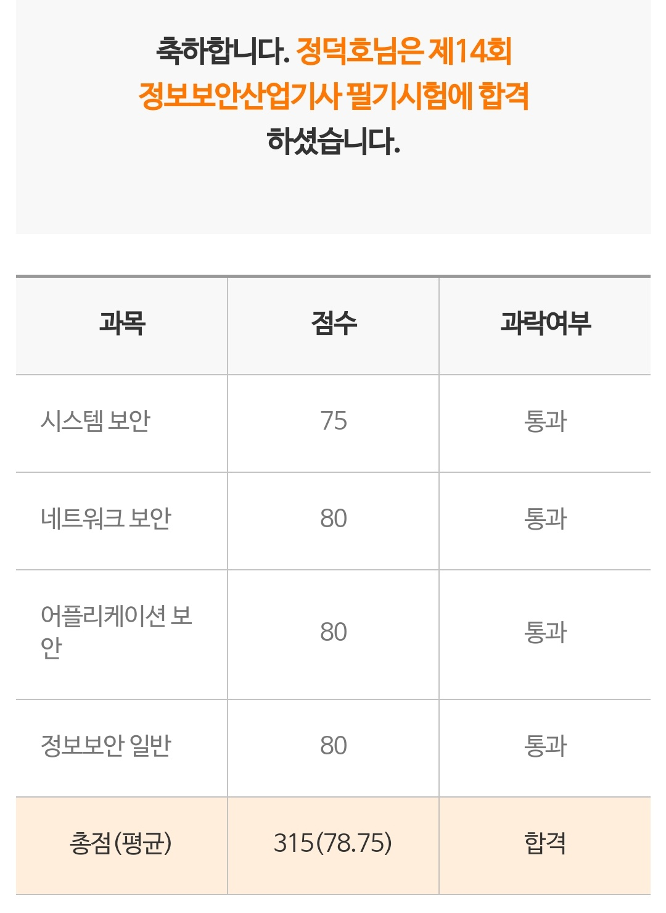
> 정보보안산업기사 실기
- 원래 바로 실기를 봤어야 군테크로 바로 기사 응시자격을 따는 것이였는데 부대 훈련과 나의 실수가 겹쳐서 접수도 못하게 되었다...
### 친구들과 여행
> 부산 여행
- 2월에 미리 약속해둔 부산여행을 가게 되었다.
- 시장 내 어묵 뷔페에 가보았는데 종류가 많아서 신기했으나 결국 다 어묵맛이였다.
- 친구와 한 길을 쭉 파는 것이 좋을지 넓게 넓게 알아가는 것이 좋을지 광안리 해수욕장에서 토의하였다.
- 대학 룸메를 만나 밀면을 먹어보았는데 내 취향은 아니였다. 그 후 간 계절 밥상도 진짜 먹을게 없었다.
- 정준이는 바빠서 바로 가버리고 나도 피곤해서 그 다음날엔 별 것 안하였다

### 그 외 변동사항
> 폰 교체
- S7이 하도 많이 깨져서 좀 바꾸고 싶어서 NOTE8로 바로 교체하였다. 그때 딱 100만원이 깨지면서 돈이 사르르 녹기 시작했다.
- U+ 기기를 샀다가 KT유심을 다운로드 못해서 애먹었다가 KT 통신사 돌아다니다 해결했다.
- 카메라가 진짜 안좋아서 서비스센터를 가야되나 생각중이다.

### 2019년은 이랬구나
> 다섯마리 여섯마리 토끼를 잡으려하다가 하나도 제대로 못잡았다.
- 웹 풀스택, 보안 연구, 네트워크 공부, 딥러닝 ... 멋있어보이는 건 다 계획
- 계획에서만 끝난게 대부분인게 문제
- 제대로된 계획을 세우지 않은건 ToDo에 넣지도 말아야겠다.

### 2020년에는 이래야지
> 한마리 한마리 집중하며 잡아야지
- 계획을 할 때는 기간, 정량 측정가능하거나 확실한 기준이 보이는 목표, 적절한 난이도를 다 고려하여 세워야 겠다.
- 인턴에 대해 기간, 요구사항, 학업과 병행가능 여부, 급여 여부 등을 알아보자
- 취업에 대해 조사를 시작해보고 나의 미래 직업 목표에 대해 3~4개를 뽑고 그에 맞는 회사들을 다 조사해보자.
- 열리는 해커톤에 대해 알아보고 휴가 기간에 한번쯤 도전해보려 한다.
  - 이를 위해서는 해커톤에서 사용가능할 언어 하나쯤은 제대로 익혀둬야겠다.
  - 연초에 Toy Project를 제대로 계획하여 봄 안에 프로젝트 하나를 완성해보겠다.
- 돈 좀 아끼고 월급이 늘어나는 김에 소소한 적금을 하나 더 만들까한다. 


